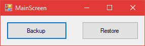

  

# MigrationTools
Simple tools I use at work for computer migrations

**Contains:**

* Windows 7 Easy Migration Tool (works on windows 10)
* Bookmark Backup tool
* Computer info backup/restore (Computer name, description, IP, MAC)
* Domain removal/addition
* Basic printer backup/restore

# Usage:
**Backup:**

* Computer info
  - Computer Name
  - Computer Description
  - IP Address
  - MAC Address
  - User running the Migration program
  - Date when program was run
* Printers
  - Backs up basic drivers for all installed printers (Will not backup printer software)
* Bookmarks
  - Backs up Chrome/Firefox bookmarks from selected user(s)
* Migration
  - Launches Windows 7 Migration Tool
* Domain
  - Removes machine from domain (Will not auto restart)

**Restore:**
* Computer Info
  - Restores Computer Name
  - Restores Computer Description
* Printers
  - Restores basic drivers
* Bookmarks
  - Restores bookmarks to selected profiles
* Migration
  - Launches Windows 7 Migration Tool
* Domain
  - Puts machine back on domain
* Computer Info / Domain (Both checked, nothing else)
  - Machine will change name/description, move the domain script to the main drive, restart the machine, and auto run the domain script on next login
